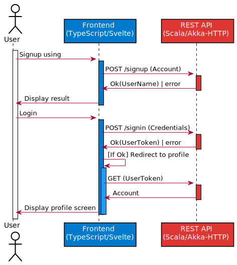
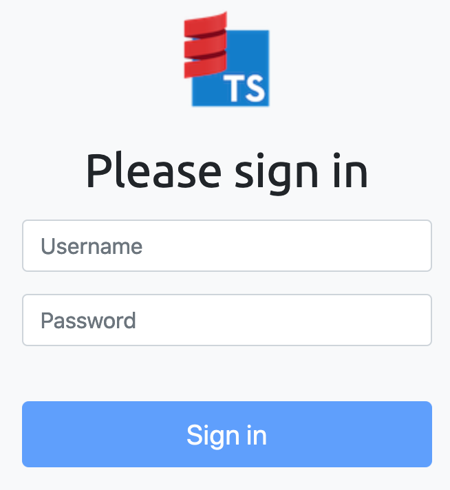
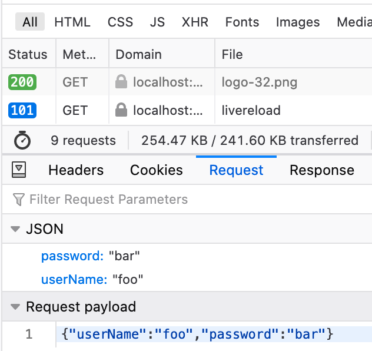
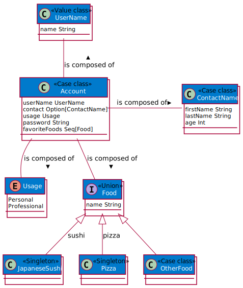

# Akka HTTP/idonttrustlikethat demonstration

This is a *Scala-TS* demonstration with a REST API managing user information, and a TypeScript [SPA](https://en.wikipedia.org/wiki/Single-page_application) as frontend for this API.

This is a *Scala-TS* demonstration based on the [Akka HTTP/Svelte one](./demo-akka-http-svelte.html), with the addition of [idonttrustlikethat](https://scala-ts.github.io/scala-ts/#idonttrustlikethat).

This sample project demonstrates how to share the [data model](#model) and corresponding validators between the Scala REST API and the TypeScript frontend.

> See [sources on GitHub](https://github.com/scala-ts/scala-ts/tree/demo/akka-idtlt)

## Use cases

The application demonstrates several user management features.



### Login

The user can connect using his credentials, and then see his information on the profile screen.

First, the user type his name and password.



Then the frontend `POST`s as JSON the TypeScript `Credentials`.

```json
{"userName":"foo","password":"bar"}
```



> *See [TypeScript login](https://github.com/scala-ts/scala-ts/blob/demo/akka-idtlt/frontend/src/screens/signin/signin.ts#L36)*

The REST API receives the JSON data and decodes it as [Scala `Credentials`](https://github.com/scala-ts/scala-ts/blob/demo/akka-idtlt/common/src/main/scala/Account.scala#L46).

> *See [Scala SignIn endpoint](https://github.com/scala-ts/scala-ts/blob/demo/akka-idtlt/http-api/src/main/scala/Router.scala#L56)

If it's Ok, an [`AuthenticatedUser`](https://github.com/scala-ts/scala-ts/blob/demo/akka-idtlt/http-api/src/main/scala/Router.scala#L115) is sent back as JSON response.

```json
{
  "userName: "foo",
  "token": "..."
}
```

Then frontend can [validate this response](https://github.com/scala-ts/scala-ts/blob/demo/akka-idtlt/frontend/src/screens/signin/signin.ts#L92) using the generated validator.

```typescript
idtltAuthenticatedUser.validate(resp)
```

Then the frontend [redirects to the profile screen](https://github.com/scala-ts/scala-ts/blob/demo/akka-idtlt/frontend/src/screens/signin/signin.ts#L116), which `GET`s its information (according the token passed as [HTTP authentication](https://developer.mozilla.org/en-US/docs/Web/HTTP/Authentication)).

## Model

The demonstration models the user accounts and related information (username, credentials and token).



| Scala                        | TypeScript                  |
| ---------------------------- | --------------------------- |
| Account case class           | Account interface           |
| AuthenticatedUser case class | AuthenticatedUser interface |
| UserName value class         | string                      |
| Credentials case class       | Credentials interface       |
| UserToken value class        | string                      |

**common:** Common data model

Using *Scala-TS*, it declares the data model as Scala types, and from there the corresponding TypeScript types are generated.

```ocaml
lazy val common = (project in file("common")).
  enablePlugins(TypeScriptIdtltPlugin).
  settings(
    name := "scala-ts-demo-common",
    sourceManaged in scalatsOnCompile := {
      val dir = baseDirectory.value / ".." / "frontend" / "src" / "_generated"
      dir.mkdirs()
      dir
    }
  )
```

**http-api** REST/HTTP API

Implements the use cases based on the data model

**frontend** TypeScript Svelte frontend

## Build

Using [SBT](https://www.scala-sbt.org/):

1. Run `sbt common/compile` to compile the Scala data model, and generate the corresponding TypeScript (to `common/target/scala-ts/src_managed/`).
2. Run `sbt http-api/compile` to compile the REST API.

Since *#1* is ok, the TypeScript/Svelte frontend can be built (using the generated TypeScript).

```bash
cd frontend
export BACKEND_URL=http://http-api-base-url
yarn build
```

## Deploy

It can be deploy to [Heroku](https://www.heroku.com/) using Docker build.

- [`heroku.yml`](https://github.com/scala-ts/scala-ts/blob/demo/akka-idtlt/heroku.yml)
- `Dockerfile` ([copy frontend](https://github.com/scala-ts/scala-ts/blob/demo/akka-idtlt/Dockerfile#L12) to `src/main/resources/webroot` so it's served as static resources).